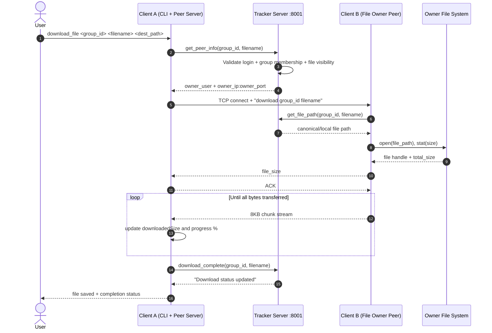
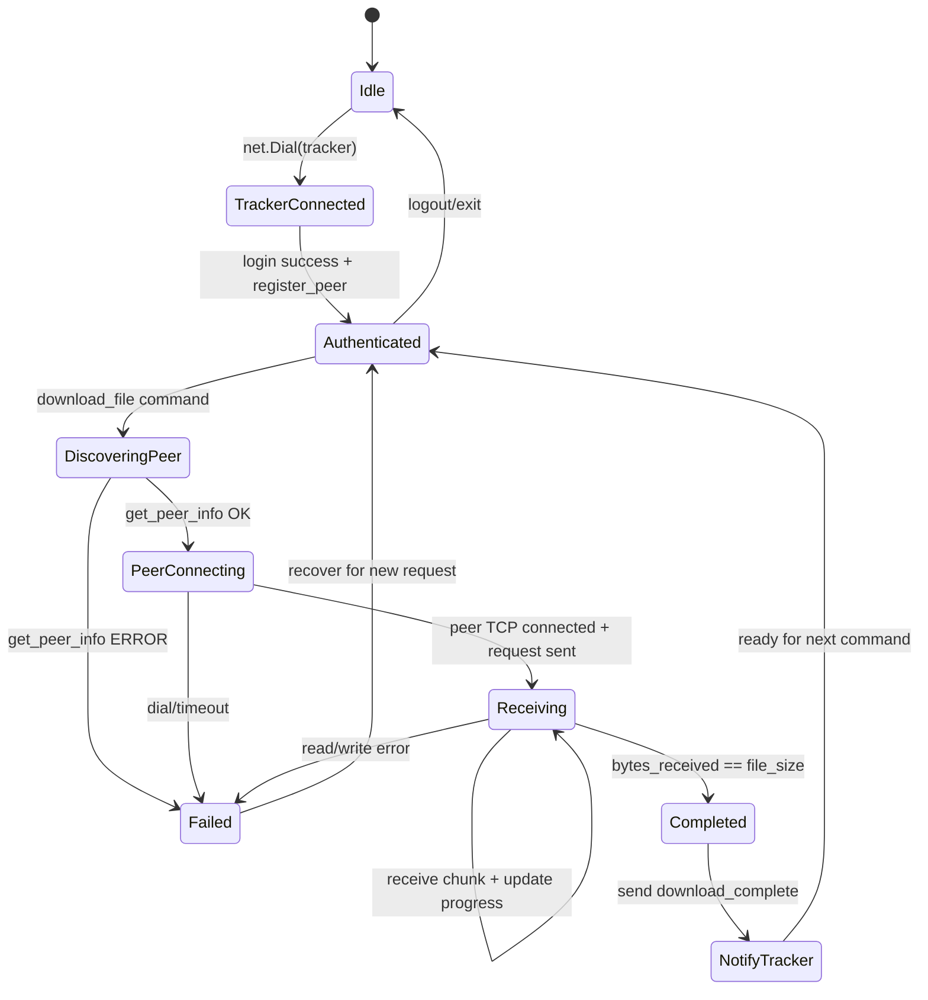
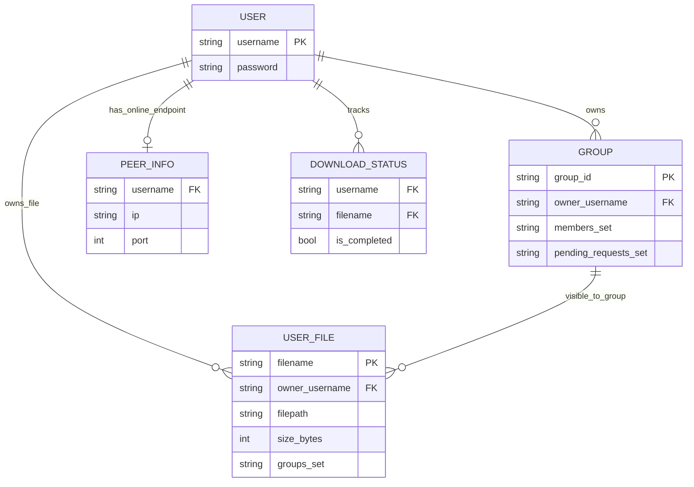

# Hybrid Peer-to-Peer File Sharing System (Go)

This project is a Go implementation of a hybrid peer-to-peer file sharing system.

It uses a central tracker for coordination (users, groups, permissions, metadata, and peer discovery), while actual file data is transferred directly between peers. This design keeps the tracker lightweight and improves scalability as more clients become active.

## Features

- User authentication and account management
- Group-based access control for shared files
- Direct peer-to-peer file transfer
- Download progress tracking
- Concurrent client handling
- Command-line interface

## Table of Contents

- [Overview](#overview)
- [Architecture](#architecture)
- [Verified Mermaid Diagrams](#verified-mermaid-diagrams)
- [Detailed System Architecture Diagram](docs/system-architecture.md)
- [Components](#components)
- [Getting Started](#getting-started)
- [Available Commands](#available-commands)
- [How It Works](#how-it-works)

## Overview

The system provides controlled file sharing with centralized metadata and decentralized file transfer. It includes:

- **Tracker Server**: coordinates users, groups, file records, and peer availability
- **Client Application**: communicates with tracker and other peers for transfer operations

The implementation is written in Go and works well on Windows for local and LAN testing.

## Architecture

The architecture is hybrid: metadata is centralized, while file transfer is distributed.

For a professional, detailed architecture set with layered flowcharts, request lifecycle sequence, client state model, ER structure, legend, and scalability annotations, see:

- [System Architecture Diagram](docs/system-architecture.md)

```text
┌──────────────────┐                 ┌───────────────┐
│                  │                 │               │
│  Tracker Server  │◄────Control─────┤  Client Peer  │
│                  │─────Status─────►│               │
└────────┬─────────┘                 └───────┬───────┘
         │                                   │
         │                                   │
         │         ┌───────────────┐         │
         │         │               │         │
         └─────────┤  Client Peer  │◄────────┘
                   │               │    File Transfer
                   └───────────────┘   (Direct P2P)
```

## Verified Mermaid Diagrams

The following diagrams are aligned with the current Go implementation in `cmd/client/main.go` and `cmd/tracker/main.go`.
They complement the ASCII diagrams below without replacing them.

### 1) System Architecture (Current Implementation)

Shows all implemented layers and interactions: client CLI, tracker command modules, in-memory data, and direct P2P file transfer.

```mermaid
flowchart LR
    subgraph CL["Client Layer"]
        U["User<br/>CLI Operator"]
        C1["Client Peer A<br/>Command Loop + Peer Server :9000"]
        C2["Client Peer B<br/>Command Loop + Peer Server :9000"]
        OUT["Output Delivery<br/>Downloaded File + Progress Status"]
    end

    subgraph SL["Server Layer"]
        subgraph TS["Tracker Service (Go TCP API :8001)"]
            API["Command API Router<br/>parseCommand + handleLine"]
            AUTH["Auth Module<br/>create_user/login/logout"]
            GRP["Group Module<br/>create/join/accept/list"]
            FILEMETA["File Metadata Module<br/>upload/list/stop_share/get_file_path"]
            PEERDISC["Peer Discovery Module<br/>register_peer/get_peer_info"]
            DLSTAT["Download Status Module<br/>show_downloads/download_complete"]
        end
    end

    subgraph DL["Data Layer"]
        MEM["In-Memory State<br/>users, groups, peerInfo, userFiles, downloads"]
        FS1["Peer A Local File System<br/>actual shared file bytes"]
        FS2["Peer B Local File System<br/>download destination bytes"]
    end

    U -->|CLI Input Command| C1
    C1 -->|TCP Request (sync)| API
    API -->|Auth checks| AUTH
    API -->|Group operations| GRP
    API -->|File metadata operations| FILEMETA
    API -->|Peer lookup| PEERDISC
    API -->|Download status write/read| DLSTAT
    AUTH -->|Read/Write user credentials| MEM
    GRP -->|Read/Write group membership| MEM
    FILEMETA -->|Read/Write file visibility| MEM
    PEERDISC -->|Read/Write online peer map| MEM
    DLSTAT -->|Read/Write transfer state| MEM
    API -->|Response text (sync)| C1

    C1 -->|get_peer_info + permission check| API
    C1 -->|Direct TCP P2P request: download group file| C2
    C2 -->|Read file bytes| FS1
    FS1 -->|Chunk stream 8KB blocks (sync)| C1
    C1 -->|Write output file| FS2
    C1 -->|download_complete (sync)| API
    C1 -->|Progress + final status| OUT

    click API "./cmd/tracker/main.go" "Tracker command dispatcher and request handling"
    click AUTH "./cmd/tracker/main.go" "Authentication command handlers"
    click GRP "./cmd/tracker/main.go" "Group ownership and membership workflow"
    click FILEMETA "./cmd/tracker/main.go" "File registration and visibility logic"
    click PEERDISC "./cmd/tracker/main.go" "Peer registration and peer lookup"
    click DLSTAT "./cmd/tracker/main.go" "Download lifecycle status tracking"
    click C1 "./cmd/client/main.go" "Client CLI + tracker and peer networking"
    click C2 "./cmd/client/main.go" "Peer listener and file sender"
    click MEM "./cmd/tracker/main.go" "In-memory maps as current data store"

    classDef frontend fill:#dbeafe,stroke:#2563eb,stroke-width:1.5px,color:#0f172a;
    classDef backend fill:#dcfce7,stroke:#16a34a,stroke-width:1.5px,color:#052e16;
    classDef database fill:#ffedd5,stroke:#ea580c,stroke-width:1.5px,color:#431407;
    classDef output fill:#fef9c3,stroke:#ca8a04,stroke-width:1.5px,color:#422006;

    class U,C1,C2 frontend;
    class API,AUTH,GRP,FILEMETA,PEERDISC,DLSTAT backend;
    class MEM,FS1,FS2 database;
    class OUT output;
```

### 2) Download Request Lifecycle

Step-by-step request-response cycle for `download_file`: peer discovery, direct transfer, and tracker completion update.



### 3) Client Download State Model

Represents the finite-state behavior of a client during a download attempt.



### 4) Logical Data Model (In-Memory)

Logical ER view of the tracker's in-memory maps and relationships.



### Mermaid Legend

- **Colors**
  - Blue: Frontend/client actors
  - Green: Backend service modules
  - Orange: Data/storage components
  - Yellow: User-visible output
- **Arrows**
  - Solid arrow (`-->`): synchronous request/response or direct data path
- **Labels**
  - `TCP Request`, `Response text`, `Chunk stream 8KB`, `download_complete`, etc. indicate key protocol/data objects.

## Components

### Tracker Server

The tracker manages metadata and access control only:

- Stores and validates user accounts
- Manages groups, memberships, and join requests
- Maintains shared file metadata
- Tracks currently online peers and their addresses
- Handles concurrent client sessions

**Key Data Structures:**
- `fileInfo`: file metadata including owner, path, size, and group visibility
- `group`: owner, members, pending requests, shared file names
- `peerInfo`: username, IP, and peer port

### Client Application

Each client handles both control-plane and data-plane roles:

- Talks to tracker for auth/group/metadata commands
- Runs a peer listener for incoming transfer requests
- Initiates direct peer-to-peer file transfer
- Provides command-line command loop
- Tracks active and completed downloads

**Key Data Structures:**
- `downloadInfo`: file/group/source/progress status
- Peer connection/session state for tracker and peer sockets

## Getting Started

### Prerequisites

- Go installed (recommended: Go 1.21+)
- Windows terminal (PowerShell or CMD)

### Build

From project root:

```powershell
go build -o tracker_go.exe ./cmd/tracker
go build -o client_go.exe ./cmd/client
```

Or use the helper script (if available):

```powershell
.\build-go.bat
```

### Start the Tracker

```powershell
.\tracker_go.exe dummy.txt 1
```

- The two arguments are accepted for compatibility.
- Tracker listens on port `8001` by default.

### Start a Client

```powershell
.\client_go.exe <tracker_ip:tracker_port>
```

Example (same machine):

```powershell
.\client_go.exe 127.0.0.1:8001
```

If the tracker is on another machine, use that LAN IP (for example `192.168.1.20:8001`).

On startup, the client:
- connects to the tracker
- starts a peer listener on port `9000`
- shows the available commands

## Available Commands

> Important: `<...>` are placeholders. Do **not** type angle brackets.

### User Management

```text
create_user <user_id> <password>
```
- Creates a new account.
- Example: `create_user john password123`

```text
login <user_id> <password>
```
- Authenticates the user.
- On success, the client automatically registers its peer endpoint with the tracker.

```text
logout
```
- Ends the current session and unregisters peer state.

### Group Management

```text
create_group <group_id>
```
- Creates a group and sets current user as owner.

```text
join_group <group_id>
```
- Sends a join request to the group owner.

```text
leave_group <group_id>
```
- Leaves group membership (owner cannot leave own group).

```text
list_requests <group_id>
```
- Owner-only: lists pending join requests.

```text
accept_request <group_id> <user_id>
```
- Owner-only: accepts a pending user request.

```text
list_groups
```
- Lists all groups and owners.

### File Operations

```text
list_files <group_id>
```
- Shows files visible in the group.

```text
upload_file <file_path> <group_id>
```
- Registers a file for sharing in the group.
- The file remains on the uploader peer; only metadata is stored on the tracker.

```text
download_file <group_id> <file_name> <destination_path>
```
- Gets peer info from the tracker, connects directly to the owner peer, and downloads the file to the destination path.

```text
show_downloads
```
- Shows current and completed downloads with progress.

```text
stop_share <group_id> <file_name>
```
- Stops sharing an owned file in that group.

### System Commands

```text
help
```
- Displays all available commands.

```text
exit
```
- Stops the client and peer listener, then exits.

## How It Works

### User Authentication Flow

```text
┌──────────┐                                 ┌─────────┐
│          │   1. create_user/login request  │         │
│  Client  ├─────────────────────────────────►         │
│          │                                 │ Tracker │
│          │   2. Authentication response    │         │
│          │◄────────────────────────────────┤         │
└──────────┘                                 └─────────┘
      │
      │ 3. If login is successful:
      │    - Start peer server
      │    - Register peer (IP:port)
      ▼
┌─────────────────┐
│                 │
│ Listening for   │
│ file requests   │
│                 │
└─────────────────┘
```

### File Transfer Process

1. **Request:** Client requests a file from a specific group.
2. **Verification:** Tracker checks group membership and file availability.
3. **Discovery:** Tracker provides IP and port of the peer with the file.
4. **Connection:** Requesting client connects directly to the file owner.
5. **Transfer:** File is sent in chunks with progress tracking.
6. **Completion:** Download state is updated at client and tracker.

```text
┌──────────┐    1. file request     ┌─────────┐
│          ├────────────────────────►         │
│ Client A │    2. peer info        │ Tracker │
│          │◄───────────────────────┤         │
└────┬─────┘                        └─────────┘
      │
      │ 3. direct connection
      ▼
┌──────────┐
│ Client B │
└────┬─────┘
      │ 4. file transfer
      └──────────────────────────────► Client A
```

### Group Management Process

```text
┌────────────┐                          ┌────────────┐
│            │  1. create_group         │            │
│  Owner     ├──────────────────────────►            │
│  Client    │                          │            │
└────────────┘                          │            │
                                        │  Tracker   │
┌────────────┐  2. join_group request   │            │
│            ├──────────────────────────►            │
│  User      │                          │            │
│  Client    │                          │            │
└────────────┘                          └────────────┘
                                               │
                 3. list_requests              │
┌────────────┐◄────────────────────────────────┘
│            │
│  Owner     │
│  Client    │  4. accept_request
│            ├────────────────────────────────►
└────────────┘                          ┌────────────┐
                                        │            │
                                        │  Tracker   │
                                        │            │
                                        └────────────┘
                                               │
                 5. group access granted       │
┌────────────┐◄────────────────────────────────┘
│            │
│  User      │
│  Client    │
│            │
└────────────┘
```

### Peer Server Operation

```text
┌─────────────────────────────────────────────────────┐
│                                                     │
│  Client Application                                 │
│                                                     │
│  ┌───────────────────┐      ┌────────────────────┐  │
│  │                   │      │                    │  │
│  │  Command Loop     │      │  Peer Server       │  │
│  │  (Main Thread)    │      │  (Background)      │  │
│  └─────────┬─────────┘      └──────────┬─────────┘  │
│            │                           │            │
│            ▼                           ▼            │
│  ┌───────────────────┐      ┌────────────────────┐  │
│  │  Tracker          │      │  File Request      │  │
│  │  Communication    │      │  Handler Routine   │  │
│  └───────────────────┘      └────────────────────┘  │
│                                                     │
└─────────────────────────────────────────────────────┘
```

### Group Management Rules

- Each group has a single owner who manages membership.
- Files can be shared with multiple groups.
- Users must join a group before accessing its files.
- Only group members can list/download group files.
- Group owners cannot leave their own groups.

---

## Conclusion

This project demonstrates a practical distributed design: centralized control with decentralized data transfer.

1. Reduced tracker load because file payloads bypass the tracker.
2. Better scalability through direct peer-to-peer transfer.
3. Clear access control using group-based permissions.
4. Efficient transfer paths with fewer network hops.

It is a solid foundation for future improvements such as checksum verification, resumable transfers, encryption, and richer peer discovery.
