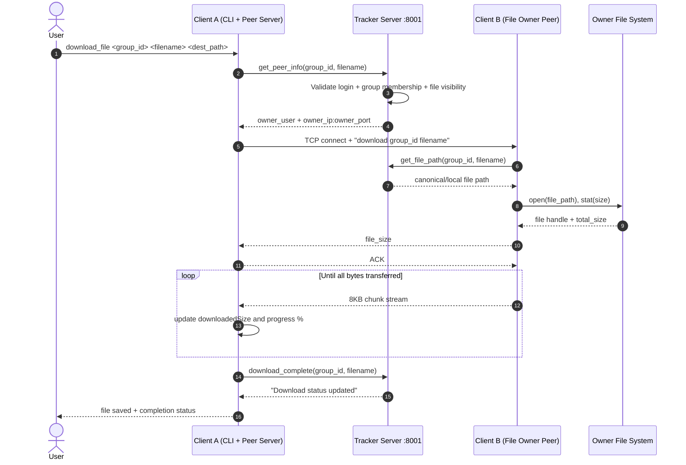
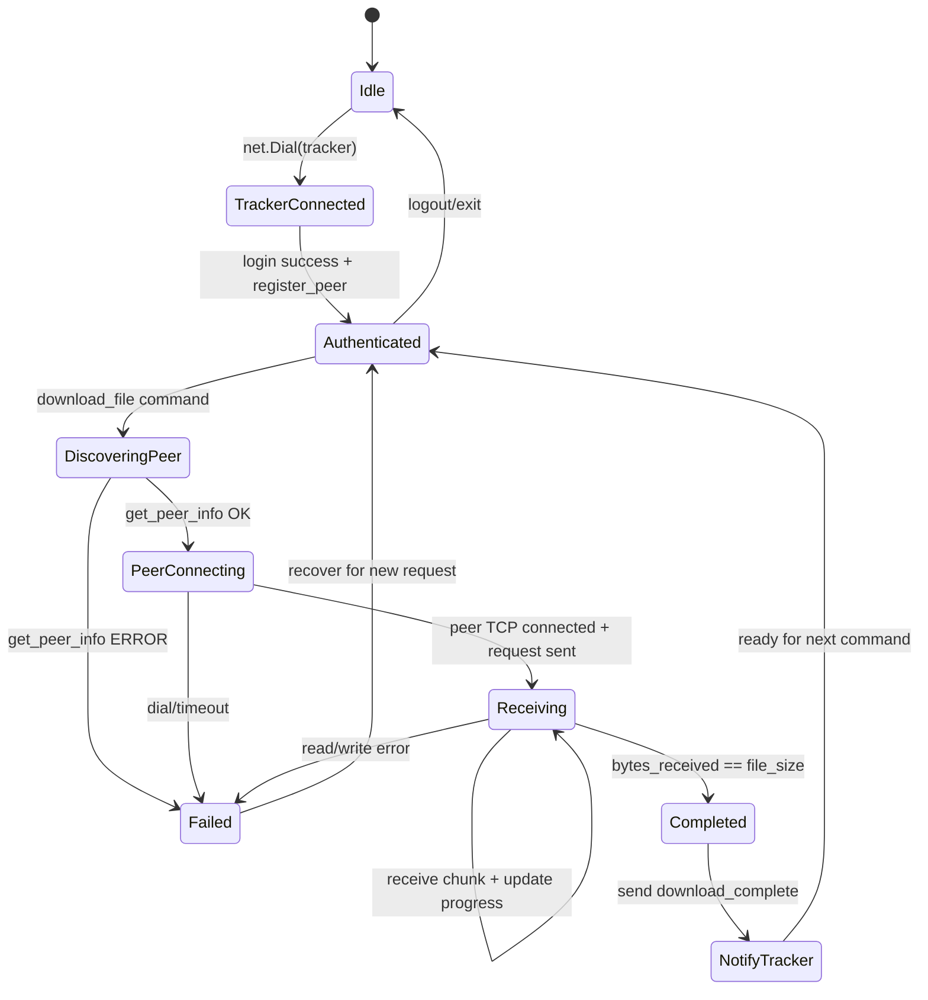
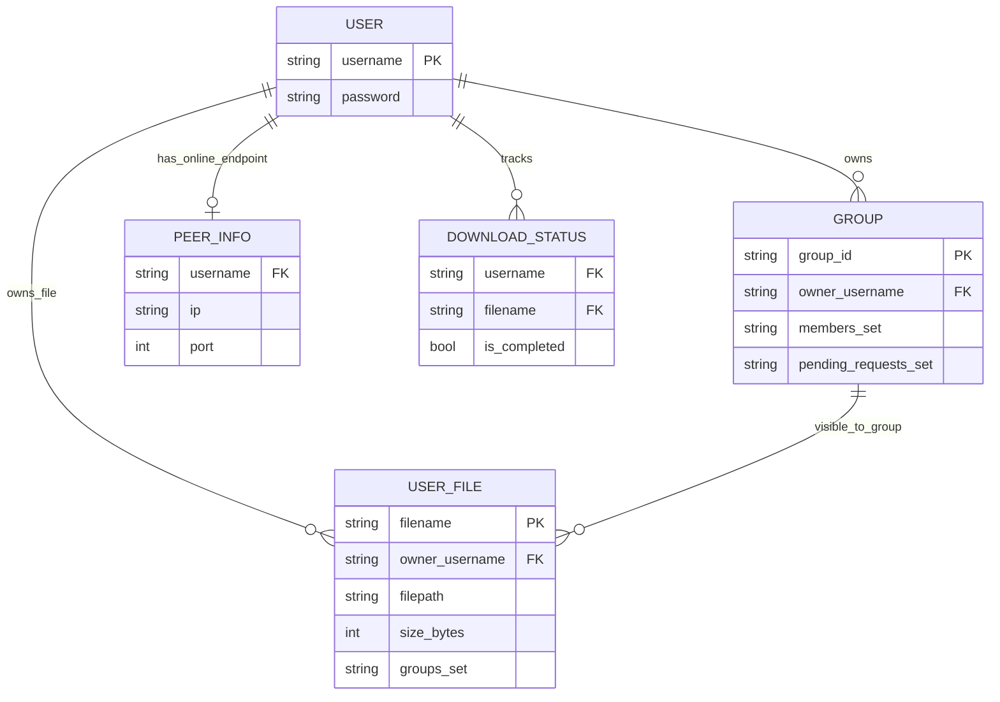

# System Architecture Diagram (Hybrid P2P FSM in Go)

This document provides a complete, viewer-friendly architecture of the **current implementation only**.

> Entry point: user runs `client_go.exe`, which talks to `tracker_go.exe` for control-plane operations and uses direct peer-to-peer transfer for file payloads.

```mermaid
%% High-level architecture with only implemented components.
flowchart LR
    %% =======================
    %% Layer: Client
    %% =======================
    subgraph CL["Client Layer"]
        U["User<br/>CLI Operator"]
        C1["Client Peer A<br/>Command Loop + Peer Server :9000"]
        C2["Client Peer B<br/>Command Loop + Peer Server :9000"]
        OUT["Output Delivery<br/>Downloaded File + Progress Status"]
    end

    %% =======================
    %% Layer: Server
    %% =======================
    subgraph SL["Server Layer"]
        subgraph TS["Tracker Service (Go TCP API :8001)"]
            API["Command API Router<br/>parseCommand + handleLine"]
            AUTH["Auth Module<br/>create_user/login/logout"]
            GRP["Group Module<br/>create/join/accept/list"]
            FILEMETA["File Metadata Module<br/>upload/list/stop_share/get_file_path"]
            PEERDISC["Peer Discovery Module<br/>register_peer/get_peer_info"]
            DLSTAT["Download Status Module<br/>show_downloads/download_complete"]
        end
    end

    %% =======================
    %% Layer: Data
    %% =======================
    subgraph DL["Data Layer"]
        MEM["In-Memory State<br/>users, groups, peerInfo, userFiles, downloads"]
        FS1["Peer A Local File System<br/>actual shared file bytes"]
        FS2["Peer B Local File System<br/>download destination bytes"]
    end

    %% Entry and control flow
    U -->|CLI Input Command| C1
    C1 -->|TCP Request (sync)| API
    API -->|Auth checks| AUTH
    API -->|Group operations| GRP
    API -->|File metadata operations| FILEMETA
    API -->|Peer lookup| PEERDISC
    API -->|Download status write/read| DLSTAT
    AUTH -->|Read/Write user credentials| MEM
    GRP -->|Read/Write group membership| MEM
    FILEMETA -->|Read/Write file visibility| MEM
    PEERDISC -->|Read/Write online peer map| MEM
    DLSTAT -->|Read/Write transfer state| MEM
    API -->|Response text (sync)| C1

    %% P2P data plane
    C1 -->|get_peer_info + permission check| API
    C1 -->|Direct TCP P2P request: download group file| C2
    C2 -->|Read file bytes| FS1
    FS1 -->|Chunk stream 8KB blocks (sync)| C1
    C1 -->|Write output file| FS2
    C1 -->|download_complete (sync)| API
    C1 -->|Progress + final status| OUT

    %% Clickable nodes (relative links for repo navigation)
    click API "./cmd/tracker/main.go" "Tracker command dispatcher and request handling"
    click AUTH "./cmd/tracker/main.go" "Authentication command handlers"
    click GRP "./cmd/tracker/main.go" "Group ownership and membership workflow"
    click FILEMETA "./cmd/tracker/main.go" "File registration and visibility logic"
    click PEERDISC "./cmd/tracker/main.go" "Peer registration and peer lookup"
    click DLSTAT "./cmd/tracker/main.go" "Download lifecycle status tracking"
    click C1 "./cmd/client/main.go" "Client CLI + tracker and peer networking"
    click C2 "./cmd/client/main.go" "Peer listener and file sender"
    click MEM "./cmd/tracker/main.go" "In-memory maps as current data store"

    %% Class definitions
    classDef frontend fill:#dbeafe,stroke:#2563eb,stroke-width:1.5px,color:#0f172a;
    classDef backend fill:#dcfce7,stroke:#16a34a,stroke-width:1.5px,color:#052e16;
    classDef database fill:#ffedd5,stroke:#ea580c,stroke-width:1.5px,color:#431407;
    classDef output fill:#fef9c3,stroke:#ca8a04,stroke-width:1.5px,color:#422006;

    class U,C1,C2 frontend;
    class API,AUTH,GRP,FILEMETA,PEERDISC,DLSTAT backend;
    class MEM,FS1,FS2 database;
    class OUT output;
```







## Critical Path and Bottlenecks

- Critical path for downloads: `Client A -> Tracker (permission + peer discovery) -> Client B (direct file stream) -> Tracker (completion update)`.
- Primary bottleneck in current design: single tracker process + in-memory state (no persistence and no native horizontal tracker coordination).
- Data-plane scales better than control-plane because file bytes bypass tracker.

## Legend

- **Colors**
  - Blue: Frontend/client actors
  - Green: Backend service modules
  - Orange: Data/storage components
  - Yellow: User-visible output
- **Arrows**
  - Solid arrow (`-->`): synchronous request/response or direct data path
  - Dotted arrow (`-.->`): asynchronous/internal transition (used only when present)
- **Labels**
  - `TCP Request`, `Response text`, `Chunk stream 8KB`, `download_complete`, etc. are key protocol/data objects traveling between nodes.
